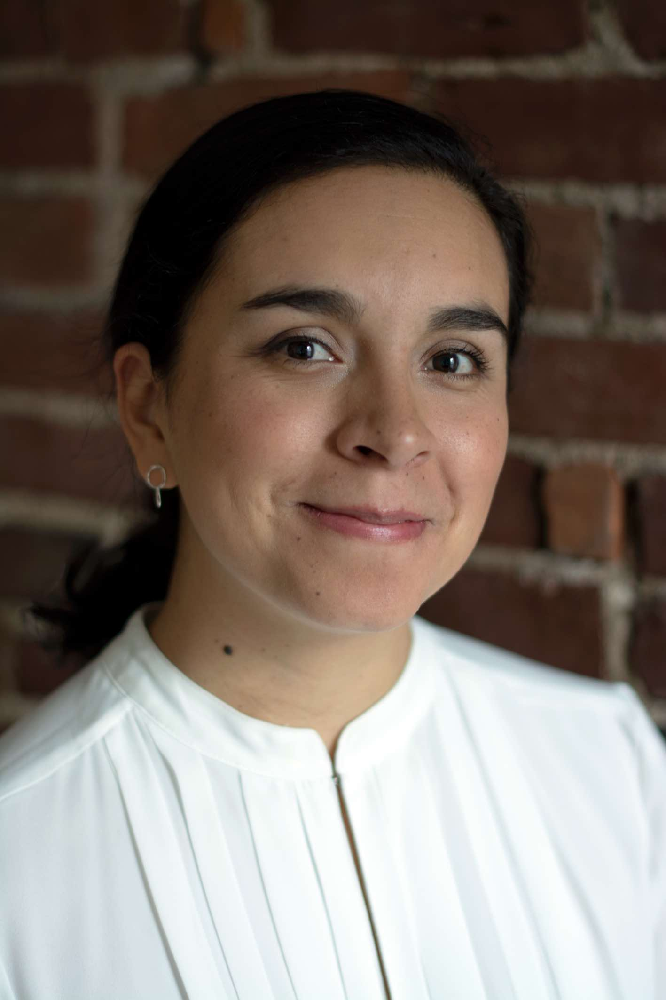

```{css, echo = F}


p{
  font-size:16px;
  line-height: 1.7em;
}

.title{
 display:none;
}

.navbar{
 display:none;
}


.borders{
   display: inline-block;
   border: 2px;
   margin: 5px;
   border-style: solid;
   border-color: #546E7A;
   padding: 5px;
   border-radius: 10px;
   color: #37474F;
    text-decoration:none;
}

.borders:hover{
    background: #546E7A;
    color: #f1f1f1;
    text-decoration: none;
}


a{
  color: #005D8F;
}

.centering {
  text-align: center;
  padding-top:5px;
}

@media screen and (min-width: 800px)  {
        .mobile-img { float:left; padding:30px; border-radius: 50%; width: 40%; display:block; margin-left:auto; margin-right:auto; margin-bottom:20px;}
}

@media screen and (max-width: 799px)  {
        .mobile-img { width: 70%; border-radius: 50%; display:block; margin-left:auto; margin-right:auto; margin-bottom:20px; max-width: 300px; }
}

@media screen and (max-width: 799px)  {
        .mobile-break {display:none;}
}

@media screen and (min-width: 600px)  {
        .mobileonly-break {display:none;}
}

.flex-container {
    display: flex;
    flex-direction: row;
    margin-bottom: 10px;
}

.flex-left {
    width: 20%;
}

.flex-right {
    width: 80%;
}

/* Responsive layout - makes a one column layout instead of a two-column layout */
@media (max-width: 800px) {
  .flex-container {
    flex-direction: column-reverse;
    margin-bottom: 5px;
  }
  .flex-left {
    width: 100%;
  }
  
  .flex-right {
    width: 100%;
  }
}

#feat_img {
  border: 1px solid #ddd; /* Gray border */
  border-radius: 4px;  /* Rounded border */
  padding: 5px; /* Some padding */
  width: 150px; /* Set a small width */
  margin-right: 10px;
  vertical-align:center;
}

/* Add a hover effect (blue shadow) */
#feat_img:hover {
  box-shadow: 0 0 2px 1px rgba(0, 140, 186, 0.5);
}
```


```{js echo = FALSE}
$(document).ready(function(){
	
   // external links to new window
    $('a[href^="http://"]').not('a[href*="https://yinaquique.netlify.app/"]').attr('target','_blank');
    
    // force PDF Files to open in new window
    $('a[href$=".pdf"]').attr('target', '_blank');

  });
```

```{r echo = FALSE, out.extra = 'class="mobile-img"'}

```

<br class = "mobile-break">

<center>

## Yina Quique

</center>

I am a clinician-scientist committed to improving rehabilitation outcomes and healthcare services for stroke survivors with aphasia. I am especially interested in developing culturally-sensitive and language-specific interventions for Spanish speakers with aphasia. 

Outside of my work life, I enjoy coffee dates with my husband. I also love reading children's books to my niece and nephew.  

::: {.centering}
[`r fontawesome::fa("twitter")` Twitter](https://twitter.com/yinaquique){.borders}
[`r fontawesome::fa("github")` Github](https://github.com/yyinaa){.borders}
[`r fontawesome::fa("paper-plane")` Email](mailto:yinaquique@northwestern.edu){.borders}
[`r fontawesome::fa("university")` Pitt Lab](https://www.lrcl.pitt.edu/people/yina-quique-ms){.borders}
:::

::: {style="clear:both;"}
:::

<br class = "mobileonly-break">

### My research path

I was trained as a Speech and Language Pathologist in Colombia, where I practiced for more than seven years. During that time, it gradually became evident that aphasia assessments and treatments were not designed for Spanish-speaking individuals and that a direct translation from English resources did not fully meet the needs of my patients. Moreover, over 85% of published aphasia treatment research has focused on English, leaving a need to advance aphasia research and evidence-based service delivery in other languages and cultures. To address this disparity, my research program has included:

1) a doctoral training that allowed me to help improving aphasia rehabilitation for Spanish speakers by adapting assessments and a gold-standard aphasia treatment –script training– for Colombian people with aphasia (Quique et al., 2018; Quique et al., submitted). 

2) An international aphasia research network, the Collaboration of Aphasia Trialists –CATs, where I work to adapt assessments for linguistically diverse populations. CATs has also helped me to foster international collaborations between educational, research, and healthcare institutions, preparing me to contribute to positive real-world changes in service delivery and outcomes for people with aphasia. 

3) A theoretical-driven approach to understanding the mechanisms of aphasia treatment response combined with advanced statistical methodologies (Quique et al., 2019). 

For my postdoctoral training, I'm strengthening my aphasia rehabilitation training by working with Dr. Leora Cherney. I'm also combining it with practical training in healthcare service delivery and outcomes research at the Center for Education in Health Sciences,Northwestern University

</br>

```{r, include=FALSE}
library(magrittr) # For the pipe
source("R/cv_printing_functions_website.r")
# Read in all data and initialize a CV printer object
CV <- create_CV_object(
  data_location = "https://docs.google.com/spreadsheets/d/1p4F9WyTBiXNOkmspuJdPZdLaQm7F-rj3lAgrL5yH3Pg/edit?usp=sharing",  
  pdf_mode = 'false'
)
```

</br>

### Recent Publications

```{r results='asis', echo = FALSE}
# Note the special double pipe so we modify the CV object in place
CV %<>% print_section("publications") 
```

</br>

### Selected Presentations

```{r results='asis', echo = FALSE}
# Note the special double pipe so we modify the CV object in place
CV %<>% print_section("presentations", glue_template = "poster") 
```

<!-- </br> -->

<!-- ### Recent Publications -->

<!-- Evans, W. S., Hula, W.D., **Quique, Y.**, Starns, J. J. (2020). How much time do people with aphasia need to respond during picture naming? Estimating optimal response time cutoffs using a multinomial ex-gaussian approach. Journal of Speech, Language, and Hearing Research. 1–16. -->

<!-- **Quique, Y. M.**, Evans, W. S., & Dickey, M. W. (2019). Acquisition and generalization responses in aphasia naming treatment: a meta-analysis of Semantic Feature Analysis outcomes. American Journal of Speech-Language Pathology, 28(1S), 230-246.  -->

<!-- Evans, WS, **Quique, Y.M** (in press). Understanding speed-accuracy processing dynamics in aphasia using response time modeling. Seminars in Speech and Language. -->

<!-- Evans, WS, Cavanaugh, RB, **Quique, Y**, Boss, E, Starns, JJ, Hula, WD. (in press). Playing with BEARS: Balancing Effort, Accuracy, and Response Speed in a Semantic Feature Verification Anomia Treatment Game. Journal of Speech, Language, and Hearing Research -->

<!-- **Quique, Y.**, Swiderski, A. M., Hula, W., & Dickey, M. (under review). Meta-analysis of Treatment of Underlying Forms: dosage-related and person-level predictors of acquisition and generalization response.  -->

<!-- Cavanaugh, RB, Kravetz, C, Jarold, L, **Quique, Y**, Turner, R, Evans, WS. (under review). Is there a research-practice dosage gap in aphasia rehabilitation?  -->

<!-- **Quique, Y**, Evans, WS, Ortega-Llebaría, M, Zipze, L., Dickey, MW (under review). Get in Sync: Speech Entrainment Mechanisms and Individual Characteristics for Scripted-Sentence Learning in Aphasia. -->

<!-- </br> -->

<!-- ### Peer-reviewed published abstracts  -->

<!-- **Quique, Y.**, Swiderski, A. M., Hula, W., & Dickey, M. (2019). Meta-analysis of Treatment of Underlying Forms: dosage-related and person-level predictors of acquisition and generalization response. Front. Hum. Neurosci. Academy of Aphasia 56th Annual Meeting. doi: 10.3389/conf.fnhum.2018.228.00004. -->

<!-- **Quique, Y.**, Dresang, H., & Dickey, M. W. (2018). Semantic memory for objects, actions, and events in Colombian people with aphasia. Aphasiology, 32(sup1), 172-175. doi: 10.1080/02687038.2018.1485845. -->

<!-- </br> -->

<!-- ### Selected Presentations -->

<!-- **Quique ,Y.**, Cavanaugh, R., Starns, J., Boss, E., Hula, W., and Evans, WS (2021). Estimating the speed-accuracy tradeoff “Sweet Spot” in language performance for people with aphasia: replication and extension of a diffusion-model based approach. Abstract for poster presentation, annual Clinical Aphasiology Conference. [link to poster in slides format](images/CAC 2021 vv2.pdf) -->

<!-- **Quique, Y.**, Evans, WS., Zipze, L., Dickey, MW., (2020).  Get in sync: rhythm in speech entrainment as a mechanism for scripted-sentence learning in aphasia. Abstract for poster presentation, annual Academy of Aphasia. [link to poster in slides format](images/AoA_final.pdf) -->

<!-- **Quique, Y.**, Dresang, H., Dickey, MW. (2018). Semantic memory for objects, actions & events in Colombian people with aphasia. Abstract for research symposium in Clinical Aphasiology selected poster presentation, annual Clinical Aphasiology Conference. Austin, Texas. [link to poster](images/Final Poster.pdf) -->

<!-- **Quique, Y.**, Evans, WS and Dickey, MW. (2017). Acquisition & generalization responses in aphasia naming treatment: a meta-analysis of semantic feature analysis outcomes. Abstract for Research Symposium in Clinical Aphasiology selected poster presentation, annual Clinical Aphasiology Conference. Snowbird, Utah. [link to poster](images/CAC poster copy.pdf) -->


